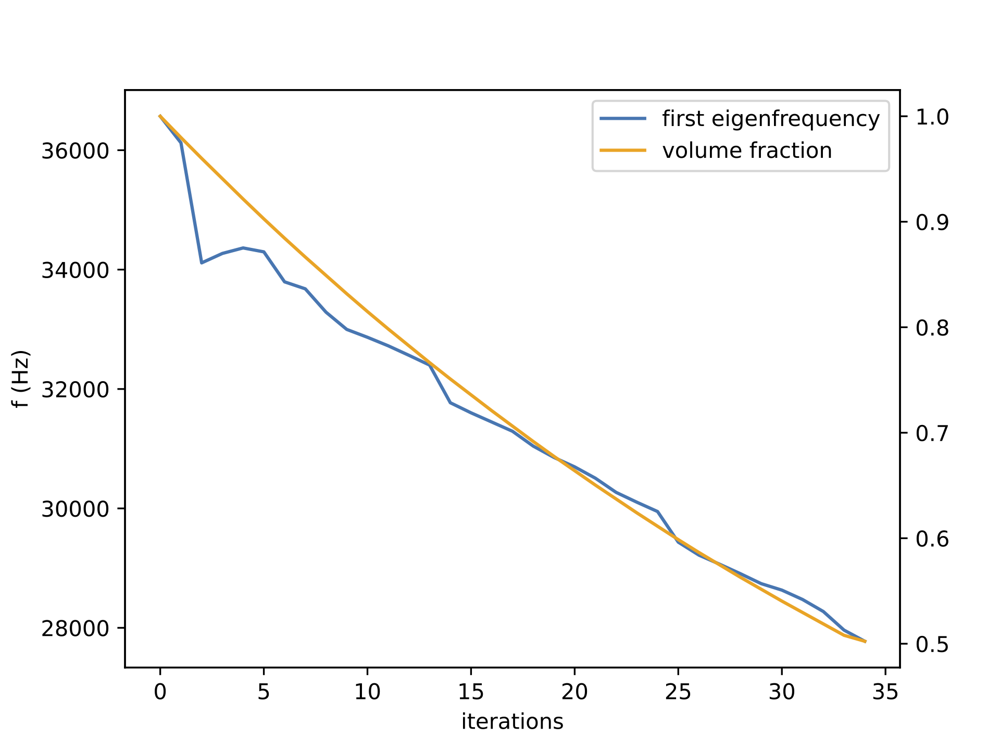

# mems-inverse-design
## Overview
This project applies topology optimization techniques to the suspension design of a capacative, out-of-plane MEMS accelerometer. The accelerometer case study is borrowed from a Master's thesis considering genetic optimization for MEMS inertial sensors [[1]](#1). 

Bi-directional evolutionary structure optimization (BESO) is used to maximize the first natural frequency of the structure while removing a specified percent of the suspension volume. The optimization formulation is described in detail in [[2]](#2).

C3D20 quadratic brick elements are used to mesh the model.  These elements have 20 nodes and 3x3x3 integration points. The shape functions used to implement these elements are described in section 4.10 of [[3]](#3). Global stiffness and mass matricies are assembled and the resulting generalized eigenvalue problem is solved using `scipy.sparse.linalg.eigsh()`.

## Results
Topology optimization for an accelerometer with a 2.4mm x 2.4mm x 320µm proof mass and 70µm thick suspension. The edges of the suspension domain are fixed. The first natural frequency starts at 36.6 kHz and is lowered to 27.8 kHz with a 50% reduction in suspension volume.

## References
<a id="1">[1]</a> 
Esteves, Rui & Wang, Chen & Kraft, Michael. (2021).
Python-Based Open-Source Electro-Mechanical Co-Optimization System for MEMS Inertial Sensors.
Micromachines. 13. 1. 10.3390/mi13010001

<a id="2">[2]</a> 
Huang, X. & Zuo, Zhihao & Xie, Yi. (2010).
Evolutionary topological optimization of vibrating continuum structures for natural frequencies.
Computers & Structures. 88. 357-364. 10.1016/j.compstruc.2009.11.011.

<a id="3">[3]</a> 
Zienkiewicz, O. & Taylor, R. & Zhu, J. (2005).
The finite element method: Its basis and fundamentals (6th ed.).
Elsevier. 
